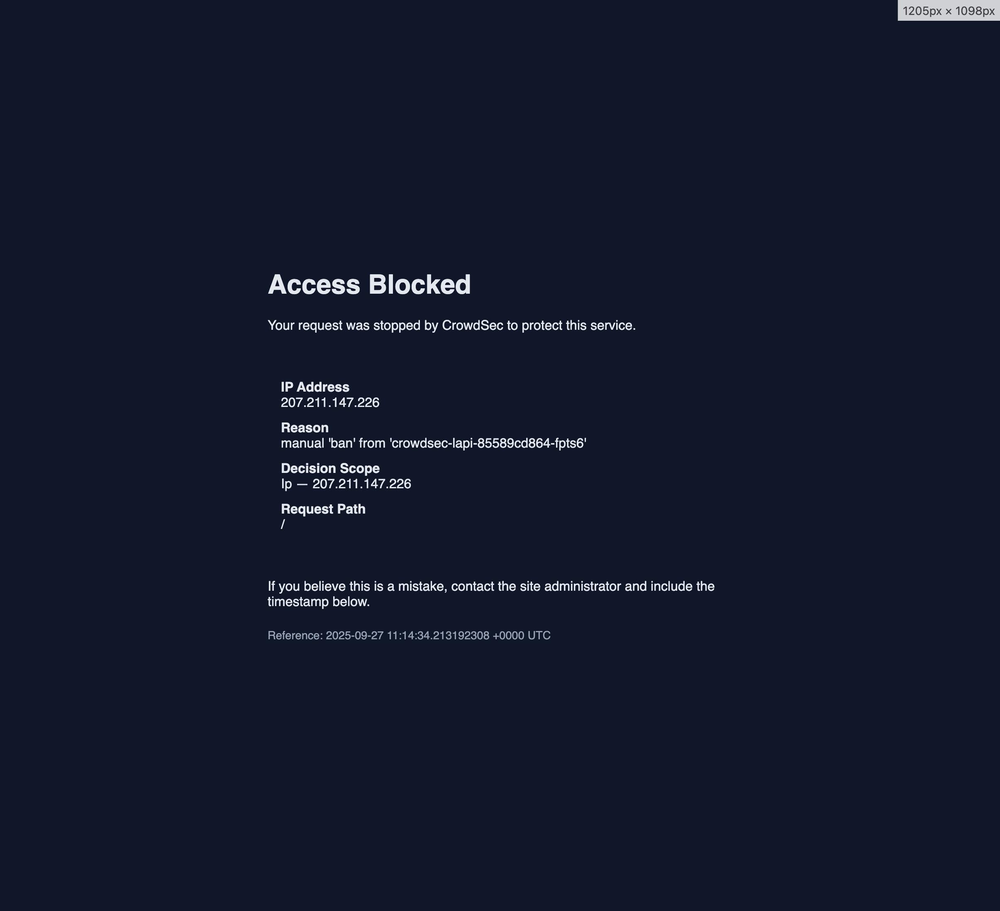

# CrowdSec Envoy Proxy Bouncer

A lightweight [CrowdSec](https://www.crowdsec.net/) bouncer for [Envoy Proxy](https://www.envoyproxy.io/) using the ext_authz filter.

## Features

- Block malicious IPs streamed via CrowdSec decisions
- Bouncer metrics reporting
- Request inspection via CrowdSec AppSec
- CAPTCHA challenges for suspicious IPs with support for:
  - Google reCAPTCHA v2
  - Cloudflare Turnstile

## How It Works

The bouncer integrates with Envoy Proxy as an external authorization service, sitting between Envoy and your backend applications. It evaluates every request through a multi-stage security pipeline:

### Request Processing Flow

1. **IP Extraction**
    - Extracts the real client IP from forwarded headers, respecting trusted proxy configuration
2. **Bouncer Check**
    - Queries the local decision cache for IP-based actions (ban or captcha)
    - Decisions are streamed in real-time from CrowdSec via the Stream API
    - Low-latency lookups using in-memory cache
3. **WAF Analysis**
    - If enabled and no blocking decision exists then the request is forwarded to Crowdsec AppSec for inspection
4. **Decision Enforcement**
    - **Allow** - Request proceeds to backend
    - **Ban** - Returns 403 with customizable ban page
    - **Captcha** - Creates session and redirects to challenge

### Ban Flow

When a banned IP attempts access, they receive a 403 response with a customizable ban page:

### CAPTCHA Flow

When CAPTCHA is enabled and a suspicious request is detected:

1. Bouncer creates a secure session and redirects to `/captcha/challenge?session=<id>`
2. User completes the CAPTCHA challenge (reCAPTCHA v2 or Cloudflare Turnstile)
3. Challenge response is verified at `/captcha/verify`
4. On success, the IP is allowlisted and user is redirected to their original destination

## Documentation

- **[Configuration Guide](docs/CONFIGURATION.md)** - Configuration options, environment variables, and examples
- **[Deployment Guide](docs/DEPLOYMENT.md)** - Kubernetes, Helm, Docker, and binary deployment instructions
- **[CAPTCHA Setup](docs/CAPTCHA.md)** - CAPTCHA provider configuration and integration
- **[Custom Templates](docs/CUSTOM_TEMPLATES.md)** - Customize ban and CAPTCHA page templates

## Examples

Kubernetes manifest examples can be found below:
- [Kubernetes Deployment](examples/deploy/README.md)
- [Real Example](https://github.com/kdwils/homelab/blob/main/monitoring/envoy-proxy-bouncer/bouncer.yaml)
- [Custom Templates](examples/deploy/custom-templates.yaml)

## Acknowledgments

* Helm schema generated with [helm-values-schema-json](https://github.com/losisin/helm-values-schema-json)
* Helm docs generated with [helm-docs](https://github.com/norwoodj/helm-docs)
