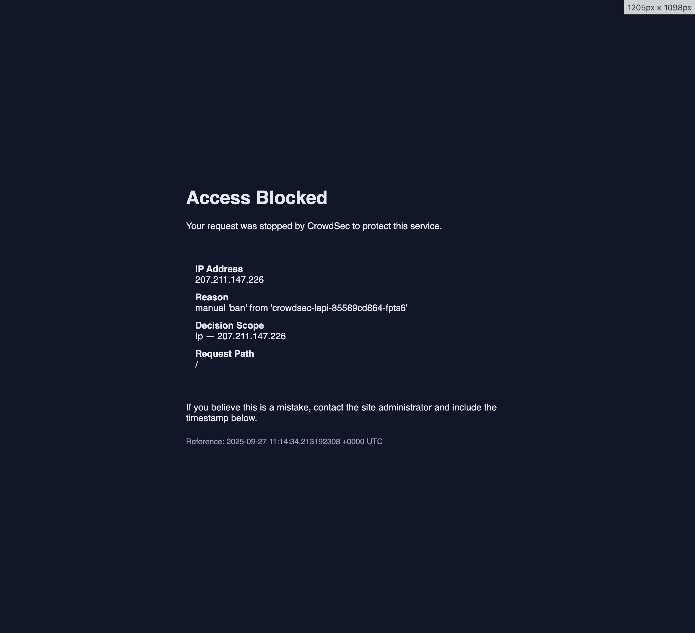

# CrowdSec Envoy Proxy Bouncer

[CrowdSec](https://www.crowdsec.net/) bouncer for [Envoy Proxy](https://www.envoyproxy.io/) using the ext_authz filter.

> [!WARNING]
> This project is in active development and has not been tested in production environments. Use at your own risk. Breaking changes may occur between releases. For the most stable experience, use a [tagged release](https://github.com/kdwils/envoy-proxy-crowdsec-bouncer/releases) rather than the `main` branch.

## Features

- Block malicious IPs streamed via CrowdSec decisions
- Bouncer metrics reporting
- Request inspection via CrowdSec AppSec
- CAPTCHA challenges for suspicious IPs with support for:
  - Google reCAPTCHA v2
  - Cloudflare Turnstile

## Supported CrowdSec Versions

The following CrowdSec versions have been tested. Other versions may work but have not been validated.

| CrowdSec Version | Status |
|------------------|--------|
| v1.7.0           | ✅ |
| v1.7.2           | ✅ |
| v1.7.3           | ✅ |
| v1.7.4           | ✅ |
| v1.7.6           | ✅ |

## How It Works

Integrates with Envoy as an external authorization service. Each request is evaluated by:

1. Extracting client IP from forwarded headers
2. Checking CrowdSec decision cache for IP-based ban or captcha decisions
3. Inspecting request with CrowdSec AppSec WAF (if enabled)
4. Enforcing decisions:
    - Allow: request proceeds
    - Ban: return 403 with ban page
    - Captcha: redirect to challenge page

## Documentation

- [Configuration Reference](docs/CONFIGURATION.md)
- [CrowdSec Integration](docs/CROWDSEC.md)
- [CAPTCHA Integration](docs/CAPTCHA.md)
- [Webhooks](docs/WEBHOOKS.md)
- [Custom Templates](docs/CUSTOM_TEMPLATES.md)
- [Signing Key Generation](docs/SIGNING_KEYS.md)
- [Deployment Guide](docs/DEPLOYMENT.md)

## Examples

- [Kubernetes Deployment](docs/examples/deploy/README.md)
- [Real Example](https://github.com/kdwils/homelab/blob/main/monitoring/envoy-proxy-bouncer/environments/homelab/homelab.yaml)
- [Custom Templates](docs/examples/deploy/custom-templates.yaml)

## Acknowledgments

* Helm schema generated with [helm-values-schema-json](https://github.com/losisin/helm-values-schema-json)
* Helm docs generated with [helm-docs](https://github.com/norwoodj/helm-docs)
