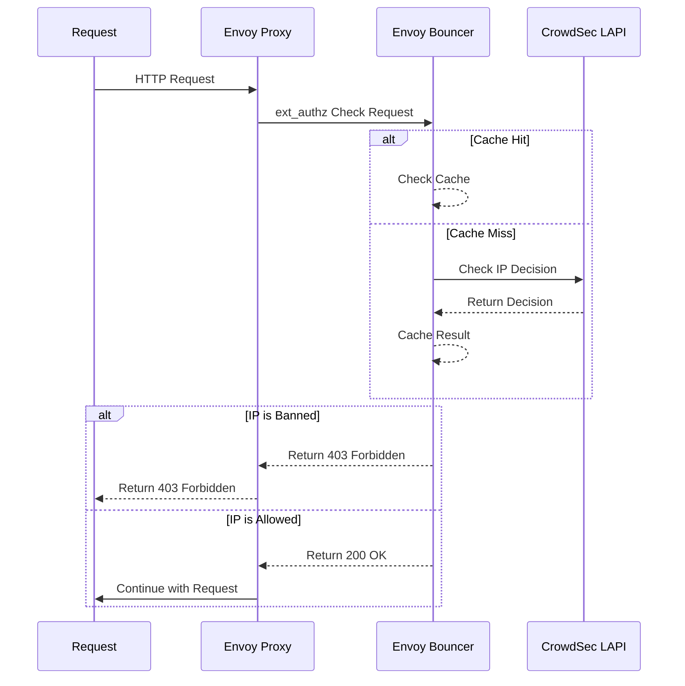

# Envoy Proxy Bouncer

A CrowdSec bouncer implementation for Envoy Proxy's external authorization (ext_authz) system. This bouncer validates incoming requests against CrowdSec decisions and blocks malicious traffic.

This project works for envoy proxy or envoy gateway in a kubernetes environment.

## How it works

The bouncer is deployed as an external authorization service for Envoy Proxy. It determines the client ip of the request, respecting trusted proxies configured, and asks the LAPI for a decision.



## Installation

```bash
go install github.com/kdwils/envoy-proxy-bouncer@latest
```

## Configuration

The bouncer can be configured using:
1. Configuration file (YAML or JSON)
2. Environment variables
3. Command line flags

### Configuration File

Create a `config.yaml` file:

```yaml
server:
  port: 8080                               # optional (defaults to 8080)
  logLevel: "info"                         # optional (defaults to info)

bouncer:
  apiKey: "your-crowdsec-bouncer-api-key"  # required
  apiURL: "http://crowdsec:8080"           # required

  metrics: true                            # optional (defaults to false) - report metrics to the LAPI instance
  
  trustedProxies:                          # optional (defaults to 127.0.0.1, ::1)
    - 192.168.0.1                          # IPv4
    - 2001:db8::1                          # IPv6
    - 10.0.0.0/8                           # CIDR range
    - 100.64.0.0/10                        # CIDR range
```

Run with config file:
```bash
envoy-proxy-bouncer serve --config config.yaml
```

### Environment Variables

All configuration options can be set via environment variables using the prefix `ENVOY_BOUNCER_` and replacing dots with underscores:

```bash
# Server configuration
export ENVOY_BOUNCER_SERVER_PORT=8080
export ENVOY_BOUNCER_SERVER_LOGLEVEL=debug

# Bouncer configuration
export ENVOY_BOUNCER_BOUNCER_APIKEY=your-api-key
export ENVOY_BOUNCER_BOUNCER_APIURL=http://crowdsec:8080
export ENVOY_BOUNCER_BOUNCER_TRUSTEDPROXIES=192.168.0.1,10.0.0.0/8
```

### Configuration Precedence

The configuration is loaded in the following order (last wins):
1. Default values
2. Configuration file
3. Environment variables
4. Command line flags

### Required Configuration

The following configuration options are required:
- `bouncer.apiKey`: CrowdSec bouncer API key
- `bouncer.apiURL`: CrowdSec API URL

### Default Values

```yaml
server:
  port: 8080
  logLevel: "info"

bouncer:
  metrics: false
  trustedProxies:
    - "127.0.0.1"
    - "::1"

cache:
  ttl: "10m"
  maxEntries: 10000
```

### Simple bouncer configuration
1. Generate an API key from your LAPI instance:
```bash
sudo cscli bouncers add envoy-bouncer
```

2. Set the key as an environment variable with your LAPI host:
```bash
export ENVOY_BOUNCER_BOUNCER_APIKEY=<your-api-key>
export ENVOY_BOUNCER_BOUNCER_APIURL=<your-lapi-host>
```

## Usage

### Starting the Bouncer

```bash
envoy-proxy-bouncer serve
```

### Testing ip Decisions

```bash
# Test if an ip is banned (multiple IPs can be specified)
envoy-proxy-bouncer bounce -i 192.168.1.1,10.0.0.1

# Manual gRPC request test
grpcurl -plaintext -d @ localhost:8080 envoy.service.auth.v3.Authorization/Check < request.json
```

An examle request would look like:
```json
{
  "attributes": {
    "source": {
      "address": {
        "socketAddress": {
          "address": "192.168.1.100",
          "portValue": 50555
        }
      }
    },
    "request": {
      "http": {
        "headers": {
          "x-forwarded-for": "192.168.1.100, 10.0.0.1"
        }
      }
    }
  }
}
```

## Docker

Build and run with Docker:

```bash
# Build
docker build -t envoy-proxy-bouncer .

# Run
docker run -p 8080:8080 \
  -v $(pwd)/config.yaml:/app/config.yaml \
  envoy-proxy-bouncer
```

## Headers

The bouncer checks for ip addresses in the following order:
1. Configured headers (in order specified in config)
2. Request's RemoteAddr

For X-Forwarded-For headers with multiple IPs the bouncer uses the first (rightmost) non-trusted ip. For this reason, it is recommended to configure the bouncer with trusted proxies.

## Response Codes

- 200 OK: Request allowed
- 403 Forbidden: Request blocked by CrowdSec decision
- 500 Internal Server Error: Bouncer configuration or runtime error

## Development

```bash
# Run tests
go test ./...

# Build from source
go build -o envoy-proxy-bouncer
```

### nix

starting a shell with the project dependencies:
```bash
nix develop .
```

## Metrics

The bouncer reports metrics to CrowdSec's dashboard including:
- Total requests processed
- Number of requests bounced
- Cached requests
- Number of unique IPs seen

These are opt-in and can be enabled by setting `metrics: true` in the bouncer config.

### Viewing Metrics
From `cscli`
```bash
cscli metrics
```

## Deploying

I have personally only tested this in a kubernetes cluster with Envoy Gateway installed. If there are other environments that aren't working, feel free to open an issue and i'll try to help.

### Kubernetes

The bouncer can be deployed in a Kubernetes cluster alongside Envoy Gateway:
An example lives [here](examples/deploy/README.md).